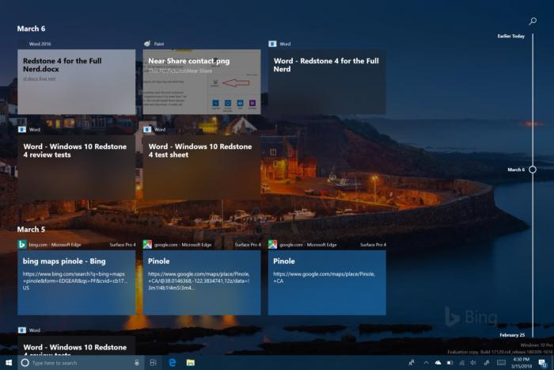
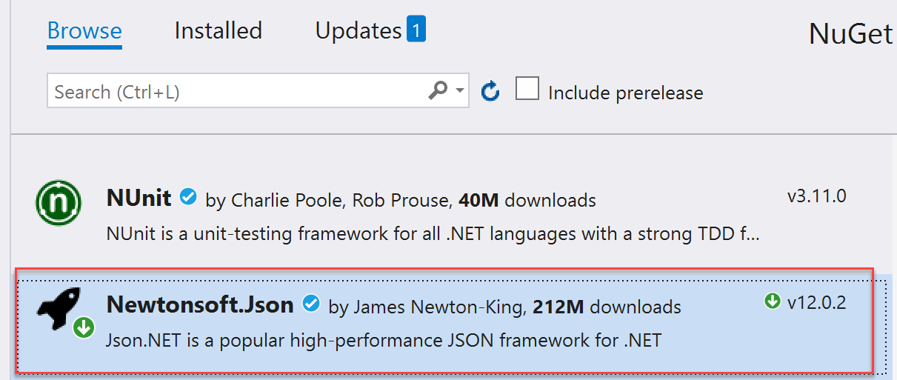
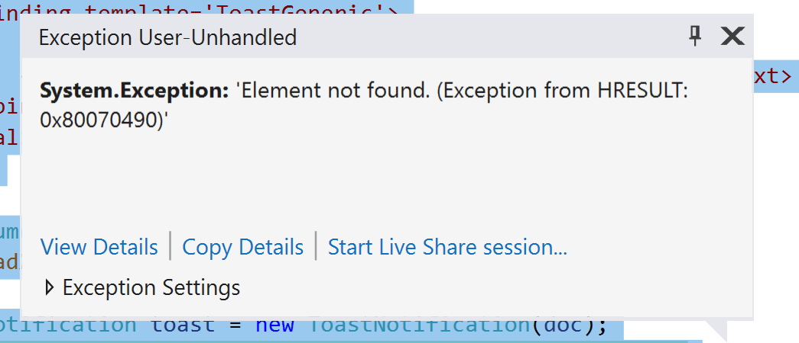

# Part 4: Add Windows 10 user activities and notifications

This is the fourth part of a tutorial that demonstrates how to modernize a sample WPF desktop app named Contoso Expenses. For an overview of the tutorial, prerequisites, and instructions for downloading the sample app, see [Tutorial: Modernize a WPF app](modernize-wpf-tutorial.md). This article assumes you have already completed [part 3](modernize-wpf-tutorial-3.md).

In the previous parts of this tutorial you added UWP XAML controls to the app using XAML Islands. As a by product of this, you also enabled the app to call any WinRT API. This opens up the opportunity for the app to use many other features offered by Windows 10, not just UWP XAML controls.

In the fictional scenario of this tutorial, the Contoso development team has decided to add two new features to the app: activities and notifications. This part of the tutorial shows how to implement these features.

## Add a user activity

In Windows 10, apps can track activities performed by the user such as opening a file or displaying a specific page. These activities are then made available through Timeline, a feature introduced in Windows 10 version 1803, which allows the user to quickly go back to the past and resume an activity they started previously.



User activities are tracked using [Microsoft Graph](https://developer.microsoft.com/graph/). However, when you're building a Windows 10 app, you don't need to interact directly with the REST endpoints provided by Microsoft Graph. Instead, you can use a convenient set of WinRT APIs. We're going to use these WinRT APIs in the Contoso Expenses app to track every time the user opens an expense within the app, and use Adaptive Cards to enable users to create the activity.

### Introduction to Adaptive Cards

This section provides a brief overview of [Adaptive Cards](https://docs.microsoft.com/adaptive-cards/). If you don't need this information, you can skip this and go right to the [add an Adaptive Card](#add-an-adaptive-card) instructions.

Adaptive Cards enable developers to exchange card content in a common and consistent way. An Adaptive Card is described by a JSON payload that defines its content, which can include text, images, actions, and more.

An Adaptive Card defines just the content and not the visual appearance of the content. The platform where the Adaptive Card is received can render the content using the most appropriate styling. The way Adaptive Cards are designed is through [a renderer](https://docs.microsoft.com/adaptive-cards/rendering-cards/getting-started), which is able to take the JSON payload and to convert it into native UI. For example, the UI could be XAML for a WPF or UWP app, AXML for an Android app, or HTML for a website or a bot chat.

Here is an example of a simple Adaptive Card payload.

```json
{
    "type": "AdaptiveCard",
    "body": [
        {
            "type": "Container",
            "items": [
                {
                    "type": "TextBlock",
                    "size": "Medium",
                    "weight": "Bolder",
                    "text": "Publish Adaptive Card schema"
                },
                {
                    "type": "ColumnSet",
                    "columns": [
                        {
                            "type": "Column",
                            "items": [
                                {
                                    "type": "Image",
                                    "style": "Person",
                                    "url": "https://pbs.twimg.com/profile_images/3647943215/d7f12830b3c17a5a9e4afcc370e3a37e_400x400.jpeg",
                                    "size": "Small"
                                }
                            ],
                            "width": "auto"
                        },
                        {
                            "type": "Column",
                            "items": [
                                {
                                    "type": "TextBlock",
                                    "weight": "Bolder",
                                    "text": "Matt Hidinger",
                                    "wrap": true
                                },
                                {
                                    "type": "TextBlock",
                                    "spacing": "None",
                                    "text": "Created {{DATE(2017-02-14T06:08:39Z,SHORT)}}",
                                    "isSubtle": true,
                                    "wrap": true
                                }
                            ],
                            "width": "stretch"
                        }
                    ]
                }
            ]
        }
    ],
    "actions": [
        {
            "type": "Action.ShowCard",
            "title": "Set due date",
            "card": {
                "type": "AdaptiveCard",
                "style": "emphasis",
                "body": [
                    {
                        "type": "Input.Date",
                        "id": "dueDate"
                    },
                    {
                        "type": "Input.Text",
                        "id": "comment",
                        "placeholder": "Add a comment",
                        "isMultiline": true
                    }
                ],
                "actions": [
                    {
                        "type": "Action.OpenUrl",
                        "title": "OK",
                        "url": "http://adaptivecards.io"
                    }
                ],
                "$schema": "http://adaptivecards.io/schemas/adaptive-card.json"
            }
        },
        {
            "type": "Action.OpenUrl",
            "title": "View",
            "url": "http://adaptivecards.io"
        }
    ],
    "$schema": "http://adaptivecards.io/schemas/adaptive-card.json",
    "version": "1.0"
}
```

The image below shows how this JSON is rendered in different ways by ta Teams channel, Cortana and a Windows notification.


Adaptive cards play an important role in Timeline because it's the way Windows renders activities. Each thumbnail displayed inside Timeline is actually an Adaptive Card. As such, when you're going to create a user activity inside your app, you will be asked to provide an Adaptive Card to render it.

> [!NOTE]
> A great way to brainstorm the design of an Adaptive Card is using [the online designer](https://adaptivecards.io/designer/). You will have the chance to design the card with building blocks (images, texts, columns, etc) and get the corresponding JSON. After you have an idea of the final design, you can use a library called [Adaptive Cards](https://www.nuget.org/packages/AdaptiveCards/) to make it easier to build your Adaptive Card using C# classes instead of plain JSON, which might be hard to debug and build.

### Add an Adaptive Card

1. Right click on the **ContosoExpenses.Core** project in Solution Explorer and choose **Manage NuGet packages**.

2. In the **NuGet Package Manager** window, click **Browse**. Search for the `Newtonsoft.Json` package and install the latest available version. This is a popular JSON manipulation library that you will use to help mainipulate the JSON strings required by Adaptive Cards.

    

    > [!NOTE]
    > If you don't install the `Newtonsoft.Json` package separately, The Adaptive Cards library will reference an older version of the `Newtonsoft.Json` package that doesn't support .NET Core 3.0.

2. In the **NuGet Package Manager** window, click **Browse**. Search for the `AdaptiveCards` package and install the latest available version.

    

3. In **Solution Explorer**, right-click the **ContosoExpenses.Core** project, choose **Add -> Class**. Name the class **TimelineService.cs** and click **OK**.

4. In the **TimelineService.cs** file, add the following statements to the top of the file.

    ```csharp
    using AdaptiveCards;
    using ContosoExpenses.Data.Models;
    ```

5. Change the namespace declared in the file from `ContosoExpenses.Core` to `ContosoExpenses`.

5. Add the following method to the `TimelineService` class.

   ```csharp
    private string BuildAdaptiveCard(Expense expense)
    {
        AdaptiveCard card = new AdaptiveCard("1.0");

        AdaptiveTextBlock title = new AdaptiveTextBlock
        {
            Text = expense.Description,
            Size = AdaptiveTextSize.Medium,
            Wrap = true
        };

        AdaptiveColumnSet columnSet = new AdaptiveColumnSet();
        AdaptiveColumn photoColumn = new AdaptiveColumn
        {
            Width = "auto"
        };

        AdaptiveImage image = new AdaptiveImage
        {
            Url = new Uri("https://appmodernizationworkshop.blob.core.windows.net/contosoexpenses/Contoso192x192.png"),
            Size = AdaptiveImageSize.Small,
            Style = AdaptiveImageStyle.Default
        };
        photoColumn.Items.Add(image);

        AdaptiveTextBlock amount = new AdaptiveTextBlock
        {
            Text = expense.Cost.ToString(),
            Weight = AdaptiveTextWeight.Bolder,
            Wrap = true
        };

        AdaptiveTextBlock date = new AdaptiveTextBlock
        {
            Text = expense.Date.Date.ToShortDateString(),
            IsSubtle = true,
            Spacing = AdaptiveSpacing.None,
            Wrap = true
        };

        AdaptiveColumn expenseColumn = new AdaptiveColumn
        {
            Width = "stretch"
        };
        expenseColumn.Items.Add(amount);
        expenseColumn.Items.Add(date);

        columnSet.Columns.Add(photoColumn);
        columnSet.Columns.Add(expenseColumn);

        card.Body.Add(title);
        card.Body.Add(columnSet);

        string json = card.ToJson();
        return json;
    }
    ```

#### About the code

This method receives an **Expense** object with all the information about the expense to render and it builds a new **AdaptiveCard** object. The method adds the following to the card:

- A title, which uses the description of the expense.
- An image, which is the Contoso logo.
- The amount of the expense.
- The date of the expense.

The last 3 elements are split into two different columns, so that the Contoso logo and the details about the expense can be placed side by side. After the object is built, the method returns the corresponding JSON string with the help of the **ToJson** method.

### Define the user activity

Now that you have defined the Adaptive Card, you can create a user activity based on it.

1. Add the following statements to the top of **TimelineService.cs** file:

    ```csharp
    using Windows.ApplicationModel.UserActivities;
    using System.Threading.Tasks;
    using Windows.UI.Shell;
    ```

    > [!NOTE]
    > These are UWP namespaces. These resolve because the `Microsoft.Toolkit.Wpf.UI.Controls` NuGet package that you installed in step 2 includes a reference to the `Microsoft.Windows.SDK.Contracts` package, which enables the **ContosoExpenses.Core** project to reference WinRT APIs even though it is a .NET Core 3 project.

2. Add the following field declarations to the `TimelineService` class.

    ```csharp
    private UserActivityChannel _userActivityChannel;
    private UserActivity _userActivity;
    private UserActivitySession _userActivitySession;
    ```

3. Add the following method to the `TimelineService` class.

    ```csharp
    public async Task AddToTimeline(Expense expense)
    {
        _userActivityChannel = UserActivityChannel.GetDefault();
        _userActivity = await _userActivityChannel.GetOrCreateUserActivityAsync($"Expense-{expense.ExpenseId}");

        _userActivity.ActivationUri = new Uri($"contosoexpenses://expense/{expense.ExpenseId}");
        _userActivity.VisualElements.DisplayText = "Contoso Expenses";

        string json = BuildAdaptiveCard(expense);

        _userActivity.VisualElements.Content = AdaptiveCardBuilder.CreateAdaptiveCardFromJson(json);

        await _userActivity.SaveAsync();
        _userActivitySession?.Dispose();
        _userActivitySession = _userActivity.CreateSession();
    }
    ```

4. Save the changes to **TimelineService.cs**.

#### About the code

The `AddToTimeline` method first gets a **UserActivityChannel** object that is required to store user activities. Then it creates a new user activity using the **GetOrCreateUserActivityAsync** method, which requires a unique identifier. This way, if an activity already exists, the app can update it; otherwise it will create a new one. The identifier to pass depends by the kind of application you're building:

* If you want to always update the same activity so that Timeline will only show the most recent one, you can use a fixed identifier (such as **Expenses**).
* If you want to track every activity as a different one, so that Timeline will display all of them, you can use a dynamic identifier.

In this scenario, the app will track each opened expense as a different user activity, so the code creates each identifier by using the keyword **Expense-** followed by the unique expense ID.

After the method creates a **UserActivity** object, it populates the object with the following info:

* An **ActivationUri** that is invoked when the user clicks on the activity in Timeline. The code uses a custom protocol called **contosoexpenses** that the app will handle later.
* The **VisualElements** object, which contains a set of properties that define the visual appearance of the activity. This code sets the **DisplayText** (which is the title displayed on top of the entry in Timeline) and the **Content**. 

This is where the Adaptive Card you defined earlier plays a role. The app passes the Adaptive Card you designed earlier as content to the method. However, Windows 10 uses a different object to represent a card compared to the one used by the `AdaptiveCards` NuGet package. Therefore, the method recreates the card by using the **CreateAdaptiveCardFromJson** method exposed by the **AdaptiveCardBuilder** class. After the method creates the user activity, it saves the activity and creates a new session.

When a user clicks on an activity in Timeline, the **contosoexpenses://** protocol will be activated and the URL will include the information the app needs to retrieve the selected expense. As an optional task, you could implement the protocol activation so that the application reacts properly when the user uses Timeline.

### Integrate the application with Timeline

Now that you have created a class that interacts with Timeline, we can start using it to enhance the application's experience. The best place to use the **AddToTimeline** method exposed by the **TimelineService** class is when the user opens the detail page of an expense.

1. In the **ContosoExpenses.Core** project, expand the **ViewModels** folder and open the **ExpenseDetailViewModel.cs** file. This is the ViewModel that supports the expense detail's window.

2. Locate the public constructor of the **ExpenseDetailViewModel** class and add the following code at the end of the constructor. Whenever the expense window is opened, the method calls the **AddToTimeline** method and passes the current expense. The **TimelineService** class uses this info to create a user activity using the expense information.

    ```csharp
    TimelineService timeline = new TimelineService();
    timeline.AddToTimeline(expense);
    ```

    When you are done, the constructor should look like this.

    ```csharp
    public ExpensesDetailViewModel(IDatabaseService databaseService, IStorageService storageService)
    {
        var expense = databaseService.GetExpense(storageService.SelectedExpense);

        ExpenseType = expense.Type;
        Description = expense.Description;
        Location = expense.Address;
        Amount = expense.Cost;

        TimelineService timeline = new TimelineService();
        timeline.AddToTimeline(expense);
    }
    ```

3. Press F5 to build and run the app in the debugger. Choose an employee from the list and then choose an expense. In the detail page, note the description of the expense, the date and the amount.

4. Press **Start + TAB** to open Timeline.

5. Scroll down the list of currently opened applications until you see the section titled **Earlier today**. This section shows some of your most recent user activities. Click the **See all activities** link next to the **Earlier today** heading.

6. Confirm that you see a new card with the information about the expense you have just selected in the application.

    

7. If you now open other expenses, you will see new cards being added as user activities. Remember that the code uses a different identifier for each activity, so it creates a card for each expense you open in the app.

8. Close the app.

## Add a notification

The second feature the Contoso development team wants to add is a notification that is shown to the user whenever a new expense is saved to the database. To do this, you can leverage the built-in notifications system in Windows 10, which is exposed to developers via WinRT APIs. This notification system has many advantages:

- Notifications are consistent with the rest of the OS.
- They are actionable.
- They get stored in Action Center so they can be reviewed later.

To add a notification to the app:

1. In **Solution Explorer**, right-click the **ContosoExpenses.Core** project, choose **Add -> Class**. Name the class **NotificationService.cs** and click **OK**.

2. In the **NotificationService.cs** file, add the following statements to the top of the file.

    ```csharp
    using Windows.Data.Xml.Dom;
    using Windows.UI.Notifications;
    ```

3. Change the namespace declared in the file from `ContosoExpenses.Core` to `ContosoExpenses`.

4. Add the following method to the `NotificationService` class.

    ```csharp
    public void ShowNotification(string description, double amount)
    {
        string xml = $@"<toast>
                          <visual>
                            <binding template='ToastGeneric'>
                              <text>Expense added</text>
                              <text>Description: {description} - Amount: {amount} </text>
                            </binding>
                          </visual>
                        </toast>";

        XmlDocument doc = new XmlDocument();
        doc.LoadXml(xml);

        ToastNotification toast = new ToastNotification(doc);
        ToastNotificationManager.CreateToastNotifier().Show(toast);
    }
    ```

    Toast notifications are represented by an XML payload, which can include text, images, actions, and more. You can find all the supported elements [here](https://docs.microsoft.com/windows/uwp/design/shell/tiles-and-notifications/toast-schema). This code uses a very simple schema with two lines of text: the title and the body. After the code defines the XML payload and loads it in a **XmlDocument** object, it wraps the XML in a **ToastNotification** object and shows it by using a the **ToastNotificationManager** class.

5. In the **ContosoExpenses.Core** project, expand the **ViewModels** folder and open the **AddNewExpenseViewModel.cs** file. 

6. Locate the `SaveExpenseCommand` method, which is triggered when the user presses on the button to save a new expense. Add the following code to this method, just after the call to the `SaveExpense` method.

    ```csharp
    NotificationService notificationService = new NotificationService();
    notificationService.ShowNotification(expense.Description, expense.Cost);
    ```

    When you are done, the `SaveExpenseCommand` method should look like this.

    ```csharp
    private RelayCommand _saveExpenseCommand;
    public RelayCommand SaveExpenseCommand
    {
        get
        {
            if (_saveExpenseCommand == null)
            {
                _saveExpenseCommand = new RelayCommand(() =>
                {
                    Expense expense = new Expense
                    {
                        Address = Address,
                        City = City,
                        Cost = Cost,
                        Date = Date,
                        Description = Description,
                        EmployeeId = storageService.SelectedEmployeeId,
                        Type = ExpenseType
                    };

                    databaseService.SaveExpense(expense);

                    NotificationService notificationService = new NotificationService();
                    notificationService.ShowNotification(expense.Description, expense.Cost);

                    Messenger.Default.Send<UpdateExpensesListMessage>(new UpdateExpensesListMessage());
                    Messenger.Default.Send<CloseWindowMessage>(new CloseWindowMessage());
                }, () => IsFormFilled
                );
            }

            return _saveExpenseCommand;
        }
    }
    ```

7. Press F5 to build and run the app in the debugger. Choose an employee from the list and then click the **Add new expense** button. Complete all fields in the form and press **Save**.

8. You will receive the following exception.

    

This exception is caused by the fact that the Contoso Expenses app doesn't yet have package identity. Some WinRT APIs, including the notifications API, require package identity before they can be used in an app. UWP apps receive package identity by default because they can only be distributed via MSIX packages. Other types of Windows apps, including WPF apps, can also be deployed via MSIX packages to obtain package identity. The next part of this tutorial will explore how to do this.

## Next steps

At this point in the tutorial, you have successfully added a user activity to the app that integrates with Windows Timeline, and you have also added a notification to the app that is triggered when users create a new expense. However, the notification doesn't yet work because the app requires package identity to use the notifications API. To learn how to build an MSIX package for the app to obtain package identity and gain other deployment benefits, see [Part 5: Package and deploy with MSIX](modernize-wpf-tutorial-5.md).
