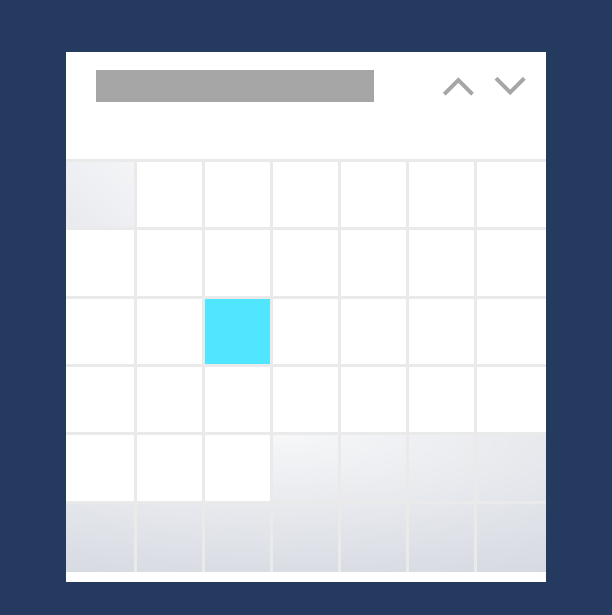
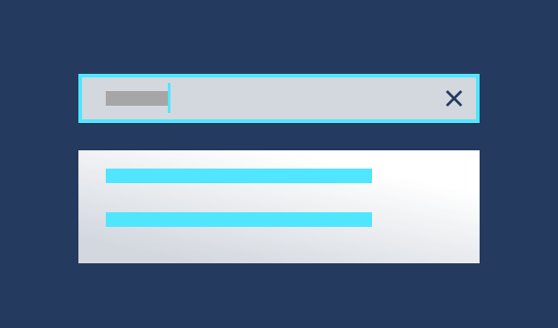
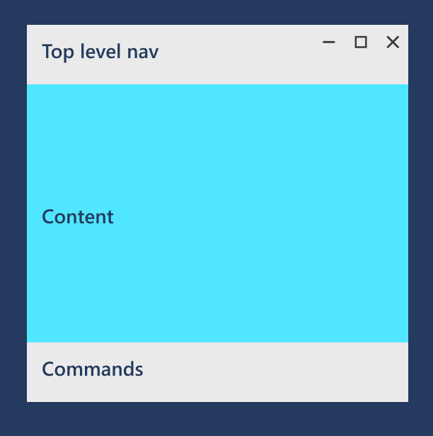
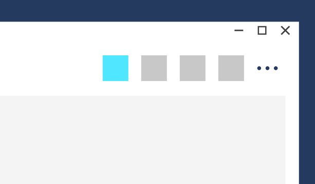
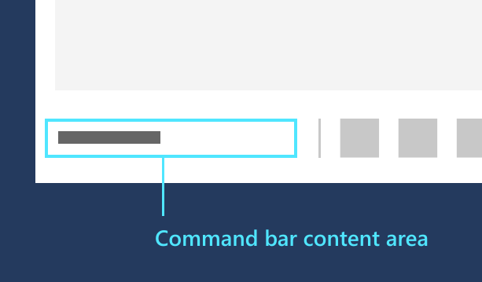

# Command design basics for UWP apps

In a Universal Windows Platform (UWP) app, *command elements* are interactive UI elements that let users perform actions such as sending an email, deleting an item, or submitting a form. *Command interfaces* are composed of common command elements, the command surfaces that host them, the interactions they support, and the experiences they provide.

## Provide the best command experience

The most important aspect of a command interface is what you're trying to let a user accomplish. As you plan the functionality of your app, consider the steps required to accomplish those tasks and the user experiences you want to enable. Once you've completed an initial draft of these experiences, then you can make decisions on the tools and interactions to implement them.

Here are some common command experiences:

- Sending or submiting information
- Selecting settings and choices
- Searching and filtering content
- Opening, saving, and deleting files
- Editing or creating content

Be creative with the design of your command experiences. Choose which input devices your app supports, and how your app responds to each device. By supporting the broadest range of capabilities and preferences you make your app as usable, portable, and accessible as possible (see [Commanding design for Universal Windows Platform (UWP) apps](../controls-and-patterns/commanding.md) for more detail).

<!--
When designing a command interface, the most important decision is choosing what a user can do. To plan the right type of interactions, focus on your app - consider the user experiences you want to enable, and what steps users will need to take. Once you decide what you want users to accomplish, then you can provide them the tools to do so.
-->

## Choose the right command elements

Using the right elements in a command interface can make the difference between an intuitive, easy-to-use app and a difficult, confusing app. A comprehensive set of command elements are available in the Universal Windows Platform (UWP). Here's a list of some of the most common UWP command elements.

:::row:::
    :::column:::

    :::column-end:::
	:::column span="2":::
<b>Buttons</b>

<a href="../controls-and-patterns/buttons.md" style="text-decoration:none">Buttons</a> trigger an immediate action. Examples include sending an email, submitting form data, or confirming an action in a dialog.
:::row-end:::

:::row:::
    :::column:::

    :::column-end:::
	:::column span="2":::
<b>Lists</b>

<a href="../controls-and-patterns/lists.md" style="text-decoration:none">Lists</a> present items in a interactive list or a grid. Usually used for many options or display items. Examples include drop-down list, list box, list view and grid view.
:::row-end:::

:::row:::
    :::column:::

    :::column-end:::
	:::column span="2":::
<b>Selection controls</b>

Lets users choose from a few options, such as when completing a survey or configuring app settings. Examples include <a href="../controls-and-patterns/checkbox.md">check box</a>, <a href="../controls-and-patterns/radio-button.md">radio button</a>, and <a href="../controls-and-patterns/toggles.md">toggle switch</a>.
:::row-end:::

:::row:::
    :::column:::

    :::column-end:::
	:::column span="2":::
<b>Calendar, date and time pickers</b>

<a href="../controls-and-patterns/date-and-time.md">Calendar, date and time pickers</a> enable users to view and modify date and time info, such as when creating an event or setting an alarm. Examples include calendar date picker, calendar view, date picker, time picker.
:::row-end:::

:::row:::
    :::column:::

    :::column-end:::
	:::column span="2":::
<b>Predictive text entry</b>

Provides suggestions as users type, such as when entering data or performing queries. Examples include <a href="../controls-and-patterns/auto-suggest-box.md">auto-suggest box</a>. 
:::row-end:::

For a complete list, see [Controls and UI elements](../controls-and-patterns/index.md)

## Place commands on the right surface

You can place command elements on a number of surfaces in your app, including the app canvas or special command containers, such as a command bar, command bar flyout, menu bar, or dialog.

Always try to let users manipulate content directly rather than through commands that act on the content, such as dragging and dropping to rearrange list items rather than up and down command buttons. 

However, this might not be possible with certain input devices, or when accommodating specific user abilities and preferences. In these cases, provide as many commanding affordances as possible, and place these command elements on a command surface in your app.

Here's a list of some of the most common command surfaces.

:::row:::
    :::column:::

    :::column-end:::
	:::column span="2":::
<b>App canvas (content area)</b>

If a command is constantly needed for users to complete core scenarios, put it on the canvas. Because you can put commands near (or on) the objects they affect, putting commands on the canvas makes them easy and obvious to use. However, choose the commands you put on the canvas carefully. Too many commands on the app canvas take up valuable screen space and can overwhelm the user. If the command won't be frequently used, consider putting it in another command surface.
:::row-end:::

:::row:::
    :::column:::

    :::column-end:::
	:::column span="2":::
<b>Command bars and menu bars</b>

<a href="../controls-and-patterns/app-bars.md">Command bars</a> help organize commands and make them easy to access. Command bars can be placed at the top of the screen, at the bottom of the screen, or at both the top and bottom of the screen (a <a href="../controls-and-patterns/menus.md#create-a-menu-bar">MenuBar</a> can also be used when the functionality in your app is too complex for a command bar).
:::row-end:::

:::row:::
    :::column:::

    :::column-end:::
	:::column span="2":::
<b>Menus and context menus</b>

Menus and context menus save space by organizing commands and hiding them until the user needs them. Users typically access a menu or context menu by clicking a button or right-clicking a control.
 

The <a href="../controls-and-patterns/command-bar-flyout.md">command bar flyout </a> is a type of contextual menu that combines the benefits of a command bar and a context menu into a single control. It can provide shortcuts to commonly-used actions and provide access to secondary commands that are only relevant in certain contexts, such as clipboard or custom commands.

UWP also provides a set of traditional menus and context menus; for more info, see the <a href="../controls-and-patterns/menus.md">menus and context menus overview</a>.

:::row-end:::

## Provide command feedback 

Command feedback communicates to users that an interaction or command was detected, how the command was interpreted and handled, and whether the command was successful or not. This helps users understand what they've done, and what they can do next. Ideally, feedback should be integrated naturally in your UI, so users don't have to be interrupted, or take additional action unless absolutely necessary.

> [!NOTE]
> Provide feedback only when necessary and only if it's not available elsewhere. Keep your application UI clean and uncluttered unless you are adding value.

Here are some ways to provide feedback in your app.

:::row:::
    :::column:::

    :::column-end:::
	:::column span="2":::
<b>Command bar</b>

The content area of the <a href="../controls-and-patterns/app-bars.md">command bar</a> is an intuitive place to communicate status to users if they'd like to see feedback.
:::row-end:::

:::row:::
    :::column:::

    :::column-end:::
	:::column span="2":::
<b>Flyouts</b>

       <a href="../controls-and-patterns/dialogs-and-flyouts/index.md">Flyouts</a> are lightweight contextual popups that can be dismissed by tapping or clicking somewhere outside the flyout.
:::row-end:::

:::row:::
    :::column:::

    :::column-end:::
	:::column span="2":::
<b>Dialog controls</b>

<a href="../controls-and-patterns/dialogs-and-flyouts/index.md">Dialog controls</a> are modal UI overlays that provide contextual app information. In most cases, dialogs block interactions with the app window until being explicitly dismissed, and often request some kind of action from the user. Dialogs can be disruptive and should only be used in certain situations. For more info, see the [When to confirm or undo actions](#when-to-confirm-or-undo-actions) section.
    :::column-end:::
:::row-end:::

> [!TIP]
> Be careful of how much your app uses confirmation dialogs; they can be very helpful when the user makes a mistake, but they are a hindrance whenever the user is trying to perform an action intentionally.

### When to confirm or undo actions

No matter how well-designed your application's UI is, all users perform an action they wish they hadn't. Your app can help in these situations by requiring confirmation of an action, or by providing a way to undo recent actions.

:::row:::
    :::column:::

For actions that can't be undone and have major consequences, we recommend using a confirmation dialog. Examples of such actions include:
-   Overwriting a file
-   Not saving a file before closing
-   Confirming permanent deletion of a file or data
-   Making a purchase (unless the user opts out of requiring a confirmation)
-   Submitting a form, such as signing up for something
    :::column-end:::
	:::column:::

For actions that can be undone, offering a simple undo command is usually enough. Examples of such actions include:
-   Deleting a file
-   Deleting an email (not permanently)
-   Modifying content or editing text
-   Renaming a file
:::row-end:::

##  Optimize for specific input types

See the [Interaction primer](../input/index.md) for more detail on optimizing user experiences around a specific input type or device.

