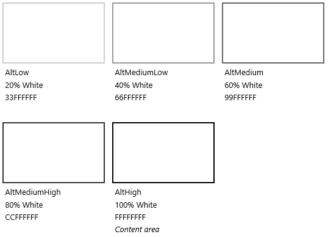
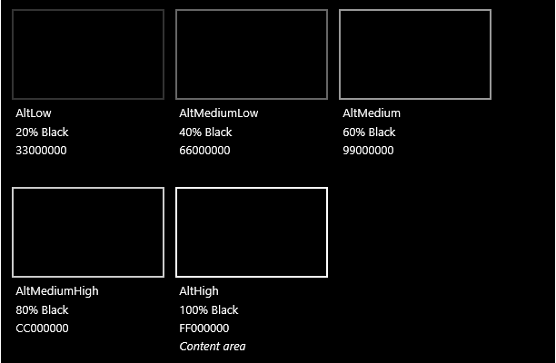
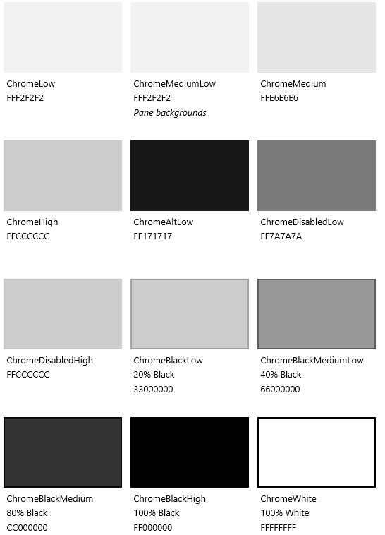
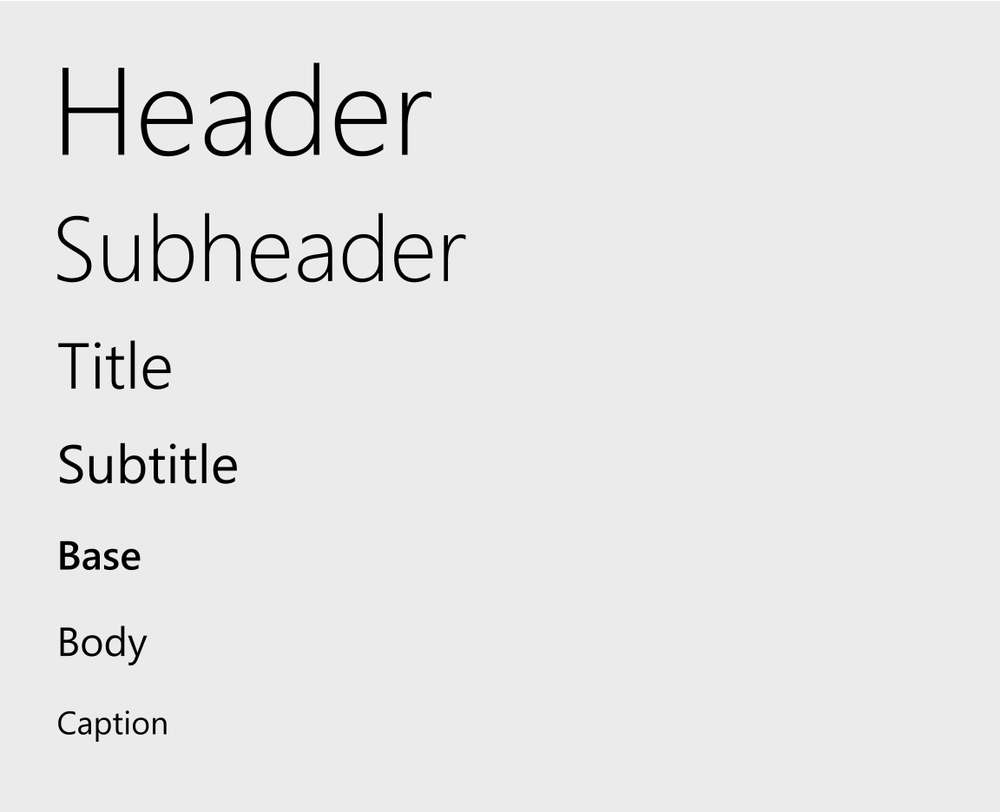

# XAML theme resources

Theme resources in XAML are a set of resources that apply different values depending on which system theme is active. There are 3 themes that the XAML framework supports: "Light", "Dark", and "HighContrast".

**Prerequisites**: This topic assumes that you have read [ResourceDictionary and XAML resource references](resourcedictionary-and-xaml-resource-references.md).

## Theme resources v. static resources

There are two XAML markup extensions that can reference a XAML resource from an existing XAML resource dictionary: [{StaticResource} markup extension](../../xaml-platform/staticresource-markup-extension.md) and [{ThemeResource} markup extension](../../xaml-platform/themeresource-markup-extension.md).

Evaluation of a [{ThemeResource} markup extension](../../xaml-platform/themeresource-markup-extension.md) occurs when the app loads and subsequently each time the theme changes at runtime. This is typically the result of the user changing their device settings or from a programmatic change within the app that alters its current theme.

In contrast, a [{StaticResource} markup extension](../../xaml-platform/staticresource-markup-extension.md) is evaluated only when the XAML is first loaded by the app. It does not update. It’s similar to a find and replace in your XAML with the actual runtime value at app launch.

## Theme resources in the resource dictionary structure

Each theme resource is part of the XAML file themeresources.xaml. For design purposes, themeresources.xaml is available in the \\(Program Files)\\Windows Kits\\10\\DesignTime\\CommonConfiguration\\Neutral\\UAP\\&lt;SDK version&gt;\\Generic folder from a Windows Software Development Kit (SDK) installation. The resource dictionaries in themeresources.xaml are also reproduced in generic.xaml in the same directory.

The Windows Runtime doesn't use these physical files for runtime lookup. That's why they are specifically in a DesignTime folder, and they aren't copied into apps by default. Instead, these resource dictionaries exist in memory as part of the Windows Runtime itself, and your app's XAML resource references to theme resources (or system resources) resolve there at runtime.

## Guidelines for custom theme resources

Follow these guidelines when you define and consume your own custom theme resources:

- Specify theme dictionaries for both "Light" and "Dark" in addition to your "HighContrast" dictionary. Although you can create a [ResourceDictionary](https://docs.microsoft.com/uwp/api/Windows.UI.Xaml.ResourceDictionary) with "Default" as the key, it’s preferred to be explicit and instead use "Light", "Dark", and "HighContrast".

- Use the [{ThemeResource} markup extension](../../xaml-platform/themeresource-markup-extension.md) in: Styles, Setters, Control templates, Property setters, and Animations.

- Don't use the [{ThemeResource} markup extension](../../xaml-platform/themeresource-markup-extension.md) in your resource definitions inside your [ThemeDictionaries](https://docs.microsoft.com/uwp/api/windows.ui.xaml.resourcedictionary.themedictionaries). Use [{StaticResource} markup extension](../../xaml-platform/staticresource-markup-extension.md) instead.

    EXCEPTION: You can use the [{ThemeResource} markup extension](../../xaml-platform/themeresource-markup-extension.md) to reference resources that are agnostic to the app theme in your [ThemeDictionaries](https://docs.microsoft.com/uwp/api/windows.ui.xaml.resourcedictionary.themedictionaries). Examples of these resources are accent color resources like `SystemAccentColor`, or system color resources, which are typically prefixed with "SystemColor" like `SystemColorButtonFaceColor`.

> [!CAUTION]
> If you don’t follow these guidelines, you might see unexpected behavior related to themes in your app. For more info, see the [Troubleshooting theme resources](#troubleshooting-theme-resources) section.

## The XAML color ramp and theme-dependent brushes

The combined set of colors for "Light", "Dark", and "HighContrast" themes make up the *Windows color ramp* in XAML. Whether you want to modify the system themes, or apply a system theme to your own XAML elements, it’s important to understand how the color resources are structured.

For additional information about how to apply color in your UWP app, please see [Color in UWP apps](../style/color.md).

### Light and Dark theme colors

The XAML framework provides a set of named [Color](/uwp/api/Windows.UI.Color) resources with values that are tailored for the "Light" and "Dark" themes. The keys you use to reference these follow the naming format: `System[Simple Light/Dark Name]Color`.

This table lists the key, simple name, and string representation of the color (using the \#aarrggbb format) for the "Light" and "Dark" resources provided by the XAML framework. The key is used to reference the resource in an app. The "Simple light/dark name" is used as part of the brush naming convention that we explain later.

| Key                             | Simple light/dark name | Light      | Dark       |
|---------------------------------|------------------------|------------|------------|
| SystemAltHighColor              | AltHigh                | \#FFFFFFFF | \#FF000000 |
| SystemAltLowColor               | AltLow                 | \#33FFFFFF | \#33000000 |
| SystemAltMediumColor            | AltMedium              | \#99FFFFFF | \#99000000 |
| SystemAltMediumHighColor        | AltMediumHigh          | \#CCFFFFFF | \#CC000000 |
| SystemAltMediumLowColor         | AltMediumLow           | \#66FFFFFF | \#66000000 |
| SystemBaseHighColor             | BaseHigh               | \#FF000000 | \#FFFFFFFF |
| SystemBaseLowColor              | BaseLow                | \#33000000 | \#33FFFFFF |
| SystemBaseMediumColor           | BaseMedium             | \#99000000 | \#99FFFFFF |
| SystemBaseMediumHighColor       | BaseMediumHigh         | \#CC000000 | \#CCFFFFFF |
| SystemBaseMediumLowColor        | BaseMediumLow          | \#66000000 | \#66FFFFFF |
| SystemChromeAltLowColor         | ChromeAltLow           | \#FF171717 | \#FFF2F2F2 |
| SystemChromeBlackHighColor      | ChromeBlackHigh        | \#FF000000 | \#FF000000 |
| SystemChromeBlackLowColor       | ChromeBlackLow         | \#33000000 | \#33000000 |
| SystemChromeBlackMediumLowColor | ChromeBlackMediumLow   | \#66000000 | \#66000000 |
| SystemChromeBlackMediumColor    | ChromeBlackMedium      | \#CC000000 | \#CC000000 |
| SystemChromeDisabledHighColor   | ChromeDisabledHigh     | \#FFCCCCCC | \#FF333333 |
| SystemChromeDisabledLowColor    | ChromeDisabledLow      | \#FF7A7A7A | \#FF858585 |
| SystemChromeHighColor           | ChromeHigh             | \#FFCCCCCC | \#FF767676 |
| SystemChromeLowColor            | ChromeLow              | \#FFF2F2F2 | \#FF171717 |
| SystemChromeMediumColor         | ChromeMedium           | \#FFE6E6E6 | \#FF1F1F1F |
| SystemChromeMediumLowColor      | ChromeMediumLow        | \#FFF2F2F2 | \#FF2B2B2B |
| SystemChromeWhiteColor          | ChromeWhite            | \#FFFFFFFF | \#FFFFFFFF |
| SystemListLowColor              | ListLow                | \#19000000 | \#19FFFFFF |
| SystemListMediumColor           | ListMedium             | \#33000000 | \#33FFFFFF |

:::row:::
    :::column:::
        #### Light theme
    :::column-end:::
    :::column:::
        #### Dark theme
    :::column-end:::
:::row-end:::

#### Base

:::row:::
    :::column:::
        
    :::column-end:::
    :::column:::
        
    :::column-end:::
:::row-end:::

#### Alt

:::row:::
    :::column:::
        
    :::column-end:::
    :::column:::
        
    :::column-end:::
:::row-end:::

#### List

:::row:::
    :::column:::
        
    :::column-end:::
    :::column:::
        
    :::column-end:::
:::row-end:::

#### Chrome

:::row:::
    :::column:::
        
    :::column-end:::
    :::column:::
        
    :::column-end:::
:::row-end:::

### Windows system high-contrast colors

In addition to the set of resources provided by the XAML framework, there's a set of color values derived from the Windows system palette. These colors are not specific to the Windows Runtime or Universal Windows Platform (UWP) apps. However, many of the XAML [Brush](/uwp/api/Windows.UI.Xaml.Media.Brush) resources consume these colors when the system is operating (and the app is running) using the "HighContrast" theme. The XAML framework provides these system-wide colors as keyed resources. The keys follow the naming format: `SystemColor[name]Color`.

This table lists the system-wide colors that XAML provides as resource objects derived from the Windows system palette. The "Ease of Access name" column shows how color is labeled in the Windows settings UI. The "Simple HighContrast name" column is a one word description of how the color is applied across the XAML common controls. It's used as part of the brush naming convention that we explain later. The "Initial default" column shows the values you'd get if the system is not running in high contrast at all.

| Key                           | Ease of Access name            | Simple HighContrast name | Initial default |
|-------------------------------|--------------------------------|--------------------------|-----------------|
| SystemColorButtonFaceColor    | **Button Text** (background)   | Background               | \#FFF0F0F0      |
| SystemColorButtonTextColor    | **Button Text** (foreground)   | Foreground               | \#FF000000      |
| SystemColorGrayTextColor      | **Disabled Text**              | Disabled                 | \#FF6D6D6D      |
| SystemColorHighlightColor     | **Selected Text** (background) | Highlight                | \#FF3399FF      |
| SystemColorHighlightTextColor | **Selected Text** (foreground) | HighlightAlt             | \#FFFFFFFF      |
| SystemColorHotlightColor      | **Hyperlinks**                 | Hyperlink                | \#FF0066CC      |
| SystemColorWindowColor        | **Background**                 | PageBackground           | \#FFFFFFFF      |
| SystemColorWindowTextColor    | **Text**                       | PageText                 | \#FF000000      |

Windows provides different high-contrast themes, and enables the user to set the specific colors to for their high-contrast settings through the Ease of Access Center, as shown here. Therefore, it's not possible to provide a definitive list of high-contrast color values.


For more info about supporting high-contrast themes, see [High-contrast themes](https://docs.microsoft.com/windows/uwp/accessibility/high-contrast-themes).

### System accent color

In addition to the system high-contrast theme colors, the system accent color is provided as a special color resource using the key `SystemAccentColor`. At runtime, this resource gets the color that the user has specified as the accent color in the Windows personalization settings.

> [!NOTE]
> While it’s possible to override the system color resources, it’s a best practice to respect the user’s color choices, especially for high-contrast settings.

### Theme-dependent brushes

The color resources shown in the preceding sections are used to set the [Color](/uwp/api/Windows.UI.Xaml.Media.SolidColorBrush.Color) property of [SolidColorBrush](/uwp/api/Windows.UI.Xaml.Media.SolidColorBrush) resources in the system theme resource dictionaries. You use the brush resources to apply the color to XAML elements. The keys for the brush resources follow the naming format: `SystemControl[Simple HighContrast name][Simple light/dark name]Brush`. For example, `SystemControlBackroundAltHighBrush`.

Let’s look at how the color value for this brush is determined at run-time. In the "Light" and "Dark" resource dictionaries, this brush is defined like this:

`<SolidColorBrush x:Key="SystemControlBackgroundAltHighBrush" Color="{StaticResource SystemAltHighColor}"/>`

In the "HighContrast" resource dictionary, this brush is defined like this:

`<SolidColorBrush x:Key="SystemControlBackgroundAltHighBrush" Color="{ThemeResource SystemColorButtonFaceColor}"/>`

When this brush is applied to a XAML element, its color is determined at run-time by the current theme, as shown in this table.

| Theme        | Color simple name | Color resource             | Runtime value                                              |
|--------------|-------------------|----------------------------|------------------------------------------------------------|
| Light        | AltHigh           | SystemAltHighColor         | \#FFFFFFFF                                                 |
| Dark         | AltHigh           | SystemAltHighColor         | \#FF000000                                                 |
| HighContrast | Background        | SystemColorButtonFaceColor | The color specified in settings for the button background. |

You can use the `SystemControl[Simple HighContrast name][Simple light/dark name]Brush` naming scheme to determine which brush to apply to your own XAML elements.

<!--
For many examples of how the brushes are used in the XAML control templates, see the [Default control styles and templates](default-control-styles-and-templates.md).
-->

> [!NOTE]
> Not every combination of \[*Simple HighContrast name*\]\[*Simple light/dark name*\] is provided as a brush resource.

## The XAML type ramp

The themeresources.xaml file defines several resources that define a [Style](https://docs.microsoft.com/uwp/api/Windows.UI.Xaml.Style) that you can apply to text containers in your UI, specifically for either [TextBlock](https://docs.microsoft.com/uwp/api/Windows.UI.Xaml.Controls.TextBlock) or [RichTextBlock](https://docs.microsoft.com/uwp/api/Windows.UI.Xaml.Controls.RichTextBlock). These are not the default implicit styles. They are provided to make it easier for you to create XAML UI definitions that match the *Windows type ramp* documented in [Guidelines for fonts](../style/typography.md).

These styles are for text attributes that you want applied to the whole text container. If you want styles applied just to sections of the text, set attributes on the text elements within the container, such as on a [Run](https://docs.microsoft.com/uwp/api/Windows.UI.Xaml.Documents.Run) in [TextBlock.Inlines](https://docs.microsoft.com/uwp/api/windows.ui.xaml.controls.textblock.inlines) or on a [Paragraph](https://docs.microsoft.com/uwp/api/Windows.UI.Xaml.Documents.Paragraph) in [RichTextBlock.Blocks](https://docs.microsoft.com/uwp/api/windows.ui.xaml.controls.richtextblock.blocks).

The styles look like this when applied to a [TextBlock](https://docs.microsoft.com/uwp/api/Windows.UI.Xaml.Controls.TextBlock):



```XAML
<TextBlock Text="Header" Style="{StaticResource HeaderTextBlockStyle}"/>
<TextBlock Text="SubHeader" Style="{StaticResource SubheaderTextBlockStyle}"/>
<TextBlock Text="Title" Style="{StaticResource TitleTextBlockStyle}"/>
<TextBlock Text="SubTitle" Style="{StaticResource SubtitleTextBlockStyle}"/>
<TextBlock Text="Base" Style="{StaticResource BaseTextBlockStyle}"/>
<TextBlock Text="Body" Style="{StaticResource BodyTextBlockStyle}"/>
<TextBlock Text="Caption" Style="{StaticResource CaptionTextBlockStyle}"/>
```

For guidance on how to use the UWP type ramp in your app, see [Typography in UWP apps](../style/typography.md).

### BaseTextBlockStyle

**TargetType**: [TextBlock](https://docs.microsoft.com/uwp/api/Windows.UI.Xaml.Controls.TextBlock)

Supplies the common properties for all the other [TextBlock](https://docs.microsoft.com/uwp/api/Windows.UI.Xaml.Controls.TextBlock) container styles.

```XAML
<!-- Usage -->
<TextBlock Text="Base" Style="{StaticResource BaseTextBlockStyle}"/>

<!-- Style definition -->
<Style x:Key="BaseTextBlockStyle" TargetType="TextBlock">
    <Setter Property="FontFamily" Value="Segoe UI"/>
    <Setter Property="FontWeight" Value="SemiBold"/>
    <Setter Property="FontSize" Value="14"/>
    <Setter Property="TextTrimming" Value="None"/>
    <Setter Property="TextWrapping" Value="Wrap"/>
    <Setter Property="LineStackingStrategy" Value="MaxHeight"/>
    <Setter Property="TextLineBounds" Value="Full"/>
</Style>
```

### HeaderTextBlockStyle

```XAML
<!-- Usage -->
<TextBlock Text="Header" Style="{StaticResource HeaderTextBlockStyle}"/>

<!-- Style definition -->
<Style x:Key="HeaderTextBlockStyle" TargetType="TextBlock"
       BasedOn="{StaticResource BaseTextBlockStyle}">
    <Setter Property="FontSize" Value="46"/>
    <Setter Property="FontWeight" Value="Light"/>
    <Setter Property="OpticalMarginAlignment" Value="TrimSideBearings"/>
</Style>
```

### SubheaderTextBlockStyle

```XAML
<!-- Usage -->
<TextBlock Text="SubHeader" Style="{StaticResource SubheaderTextBlockStyle}"/>

<!-- Style definition -->
<Style x:Key="SubheaderTextBlockStyle" TargetType="TextBlock" 
       BasedOn="{StaticResource BaseTextBlockStyle}">
    <Setter Property="FontSize" Value="34"/>
    <Setter Property="FontWeight" Value="Light"/>
    <Setter Property="OpticalMarginAlignment" Value="TrimSideBearings"/>
</Style>
```

### TitleTextBlockStyle

```XAML
<!-- Usage -->
<TextBlock Text="Title" Style="{StaticResource TitleTextBlockStyle}"/>

<!-- Style definition -->
<Style x:Key="TitleTextBlockStyle" TargetType="TextBlock" 
       BasedOn="{StaticResource BaseTextBlockStyle}">
    <Setter Property="FontWeight" Value="SemiLight"/>
    <Setter Property="FontSize" Value="24"/>
    <Setter Property="OpticalMarginAlignment" Value="TrimSideBearings"/>
</Style>
```

### SubtitleTextBlockStyle

```XAML
<!-- Usage -->
<TextBlock Text="SubTitle" Style="{StaticResource SubtitleTextBlockStyle}"/>

<!-- Style definition -->
<Style x:Key="SubtitleTextBlockStyle" TargetType="TextBlock" 
       BasedOn="{StaticResource BaseTextBlockStyle}">
    <Setter Property="FontWeight" Value="Normal"/>
    <Setter Property="FontSize" Value="20"/>
    <Setter Property="OpticalMarginAlignment" Value="TrimSideBearings"/>
</Style>
```

### BodyTextBlockStyle

```XAML
<!-- Usage -->
<TextBlock Text="Body" Style="{StaticResource BodyTextBlockStyle}"/>

<!-- Style definition -->
<Style x:Key="BodyTextBlockStyle" TargetType="TextBlock" 
       BasedOn="{StaticResource BaseTextBlockStyle}">
    <Setter Property="FontWeight" Value="Normal"/>
    <Setter Property="FontSize" Value="14"/>
</Style>
```

### CaptionTextBlockStyle

```XAML
<!-- Usage -->
<TextBlock Text="Caption" Style="{StaticResource CaptionTextBlockStyle}"/>

<!-- Style definition -->
<Style x:Key="CaptionTextBlockStyle" TargetType="TextBlock" 
       BasedOn="{StaticResource BaseTextBlockStyle}">
    <Setter Property="FontSize" Value="12"/>
    <Setter Property="FontWeight" Value="Normal"/>
</Style>
```

### BaseRichTextBlockStyle

**TargetType**: [RichTextBlock](https://docs.microsoft.com/uwp/api/Windows.UI.Xaml.Controls.RichTextBlock)

Supplies the common properties for all the other [RichTextBlock](https://docs.microsoft.com/uwp/api/Windows.UI.Xaml.Controls.RichTextBlock) container styles.

```XAML
<!-- Usage -->
<RichTextBlock Style="{StaticResource BaseRichTextBlockStyle}">
    <Paragraph>Rich text.</Paragraph>
</RichTextBlock>

<!-- Style definition -->
<Style x:Key="BaseRichTextBlockStyle" TargetType="RichTextBlock">
    <Setter Property="FontFamily" Value="Segoe UI"/>
    <Setter Property="FontWeight" Value="SemiBold"/>
    <Setter Property="FontSize" Value="14"/>
    <Setter Property="TextTrimming" Value="None"/>
    <Setter Property="TextWrapping" Value="Wrap"/>
    <Setter Property="LineStackingStrategy" Value="MaxHeight"/>
    <Setter Property="TextLineBounds" Value="Full"/>
    <Setter Property="OpticalMarginAlignment" Value="TrimSideBearings"/>
</Style>
```

### BodyRichTextBlockStyle

```XAML
<!-- Usage -->
<RichTextBlock Style="{StaticResource BodyRichTextBlockStyle}">
    <Paragraph>Rich text.</Paragraph>
</RichTextBlock>

<!-- Style definition -->
<Style x:Key="BodyRichTextBlockStyle" TargetType="RichTextBlock" BasedOn="{StaticResource BaseRichTextBlockStyle}">
    <Setter Property="FontWeight" Value="Normal"/>
</Style>
```

**Note**:  The [RichTextBlock](https://docs.microsoft.com/uwp/api/Windows.UI.Xaml.Controls.RichTextBlock) styles don't have all the text ramp styles that [TextBlock](https://docs.microsoft.com/uwp/api/Windows.UI.Xaml.Controls.TextBlock) does, mainly because the block-based document object model for **RichTextBlock** makes it easier to set attributes on the individual text elements. Also, setting [TextBlock.Text](https://docs.microsoft.com/uwp/api/windows.ui.xaml.controls.textblock.text) using the XAML content property introduces a situation where there is no text element to style and thus you'd have to style the container. That isn't an issue for **RichTextBlock** because its text content always has to be in specific text elements like [Paragraph](https://docs.microsoft.com/uwp/api/Windows.UI.Xaml.Documents.Paragraph), which is where you might apply XAML styles for page header, page subheader and similar text ramp definitions.

## Miscellaneous Named styles

There's an additional set of keyed [Style](https://docs.microsoft.com/uwp/api/Windows.UI.Xaml.Style) definitions you can apply to style a [Button](https://docs.microsoft.com/uwp/api/Windows.UI.Xaml.Controls.Button) differently than its default implicit style.

### TextBlockButtonStyle

**TargetType**: [ButtonBase](https://docs.microsoft.com/uwp/api/Windows.UI.Xaml.Controls.Primitives.ButtonBase)

Apply this style to a [Button](https://docs.microsoft.com/uwp/api/Windows.UI.Xaml.Controls.Button) when you need to show text that a user can click to take action. The text is styled using the current accent color to distinguish it as interactive and has focus rectangles that work well for text. Unlike the implicit style of a [HyperlinkButton](https://docs.microsoft.com/uwp/api/Windows.UI.Xaml.Controls.HyperlinkButton), the **TextBlockButtonStyle** does not underline the text.

The template also styles the presented text to use **SystemControlHyperlinkBaseMediumBrush** (for "PointerOver" state), **SystemControlHighlightBaseMediumLowBrush** (for "Pressed" state) and **SystemControlDisabledBaseLowBrush** (for "Disabled" state).

Here's a [Button](https://docs.microsoft.com/uwp/api/Windows.UI.Xaml.Controls.Button) with the **TextBlockButtonStyle** resource applied to it.

```XAML
<Button Content="Clickable text" Style="{StaticResource TextBlockButtonStyle}"
        Click="Button_Click"/>
```

It looks like this:


### NavigationBackButtonNormalStyle

**TargetType**: [Button](https://docs.microsoft.com/uwp/api/Windows.UI.Xaml.Controls.Button)

This [Style](https://docs.microsoft.com/uwp/api/Windows.UI.Xaml.Style) provides a complete template for a [Button](https://docs.microsoft.com/uwp/api/Windows.UI.Xaml.Controls.Button) that can be the navigation back button for a navigation app. The default dimensions are 40 x 40 pixels. To tailor the styling you can either explicitly set the [Height](/uwp/api/Windows.UI.Xaml.FrameworkElement.Height), [Width](/uwp/api/Windows.UI.Xaml.FrameworkElement.Width), [FontSize](https://docs.microsoft.com/uwp/api/windows.ui.xaml.controls.control.fontsize), and other properties on your **Button** or create a derived style using [BasedOn](https://docs.microsoft.com/uwp/api/windows.ui.xaml.style.basedon).

Here's a [Button](https://docs.microsoft.com/uwp/api/Windows.UI.Xaml.Controls.Button) with the **NavigationBackButtonNormalStyle** resource applied to it.

```XAML
<Button Style="{StaticResource NavigationBackButtonNormalStyle}" />
```

It looks like this:


### NavigationBackButtonSmallStyle

**TargetType**: [Button](https://docs.microsoft.com/uwp/api/Windows.UI.Xaml.Controls.Button)

This [Style](https://docs.microsoft.com/uwp/api/Windows.UI.Xaml.Style) provides a complete template for a [Button](https://docs.microsoft.com/uwp/api/Windows.UI.Xaml.Controls.Button) that can be the navigation back button for a navigation app. It's similar to **NavigationBackButtonNormalStyle**, but its dimensions are 30 x 30 pixels.

Here's a [Button](https://docs.microsoft.com/uwp/api/Windows.UI.Xaml.Controls.Button) with the **NavigationBackButtonSmallStyle** resource applied to it.

```XAML
<Button Style="{StaticResource NavigationBackButtonSmallStyle}" />
```

## Troubleshooting theme resources

If you don’t follow the [guidelines for using theme resources](#guidelines-for-custom-theme-resources), you might see unexpected behavior related to themes in your app.

For example, when you open a light-themed flyout, parts of your dark-themed app also change as if they were in the light theme. Or if you navigate to a light-themed page and then navigate back, the original dark-themed page (or parts of it) now looks as though it is in the light theme.

Typically, these types of issues occur when you provide a "Default" theme and a "HighContrast" theme to support high-contrast scenarios, and then use both "Light" and "Dark" themes in different parts of your app.

For example, consider this theme dictionary definition:

```XAML
<!-- DO NOT USE. THIS XAML DEMONSTRATES AN ERROR. -->
<ResourceDictionary>
  <ResourceDictionary.ThemeDictionaries>
    <ResourceDictionary x:Key="Default">
      <SolidColorBrush x:Key="myBrush" Color="{ThemeResource SystemBaseHighColor}"/>
    </ResourceDictionary>
    <ResourceDictionary x:Key="HighContrast">
      <SolidColorBrush x:Key="myBrush" Color="{ThemeResource SystemColorButtonFaceColor}"/>
    </ResourceDictionary>
  </ResourceDictionary.ThemeDictionaries>
</ResourceDictionary>
```

Intuitively, this looks correct. You want to change the color pointed to by `myBrush` when in high-contrast, but when not in high-contrast, you rely on the [{ThemeResource} markup extension](../../xaml-platform/themeresource-markup-extension.md) to make sure that `myBrush` points to the right color for your theme. If your app never has [FrameworkElement.RequestedTheme](https://docs.microsoft.com/uwp/api/windows.ui.xaml.frameworkelement.requestedtheme) set on elements within its visual tree, this will typically work as expected. However, you run into problems in your app as soon as you start to re-theme different parts of your visual tree.

The problem occurs because brushes are shared resources, unlike most other XAML types. If you have 2 elements in XAML sub-trees with different themes that reference the same brush resource, then as the framework walks each sub-tree to update its [{ThemeResource} markup extension](../../xaml-platform/themeresource-markup-extension.md) expressions, changes to the shared brush resource are reflected in the other sub-tree, which is not your intended result.

To fix this, replace the "Default" dictionary with separate theme dictionaries for both "Light" and "Dark" themes in addition to "HighContrast":

```XAML
<!-- DO NOT USE. THIS XAML DEMONSTRATES AN ERROR. -->
<ResourceDictionary>
  <ResourceDictionary.ThemeDictionaries>
    <ResourceDictionary x:Key="Light">
      <SolidColorBrush x:Key="myBrush" Color="{ThemeResource SystemBaseHighColor}"/>
    </ResourceDictionary>
    <ResourceDictionary x:Key="Dark">
      <SolidColorBrush x:Key="myBrush" Color="{ThemeResource SystemBaseHighColor}"/>
    </ResourceDictionary>
    <ResourceDictionary x:Key="HighContrast">
      <SolidColorBrush x:Key="myBrush" Color="{ThemeResource SystemColorButtonFaceColor}"/>
    </ResourceDictionary>
  </ResourceDictionary.ThemeDictionaries>
</ResourceDictionary>
```

However, problems still occur if any of these resources are referenced in inherited properties like [Foreground](https://docs.microsoft.com/uwp/api/windows.ui.xaml.controls.control.foreground). Your custom control template might specify the foreground color of an element using the [{ThemeResource} markup extension](../../xaml-platform/themeresource-markup-extension.md), but when the framework propagates the inherited value to child elements, it provides a direct reference to the resource that was resolved by the {ThemeResource} markup extension expression. This causes problems when the framework processes theme changes as it walks your control's visual tree. It re-evaluates the {ThemeResource} markup extension expression to get a new brush resource but doesn’t yet propagate this reference down to the children of your control; this happens later, such as during the next measure pass.

As a result, after walking the control visual tree in response to a theme change, the framework walks the children and updates any [{ThemeResource} markup extension](../../xaml-platform/themeresource-markup-extension.md) expressions set on them, or on objects set on their properties. This is where the problem occurs; the framework walks the brush resource and because it specifies its color using a {ThemeResource} markup extension, it's re-evaluated.

At this point, the framework appears to have polluted your theme dictionary because it now has a resource from one dictionary that has its color set from another dictionary.

To fix this problem, use the [{StaticResource} markup extension](../../xaml-platform/staticresource-markup-extension.md) instead of [{ThemeResource} markup extension](../../xaml-platform/themeresource-markup-extension.md). With the guidelines applied, the theme dictionaries look like this:

```XAML
<ResourceDictionary>
  <ResourceDictionary.ThemeDictionaries>
    <ResourceDictionary x:Key="Light">
      <SolidColorBrush x:Key="myBrush" Color="{StaticResource SystemBaseHighColor}"/>
    </ResourceDictionary>
    <ResourceDictionary x:Key="Dark">
      <SolidColorBrush x:Key="myBrush" Color="{StaticResource SystemBaseHighColor}"/>
    </ResourceDictionary>
    <ResourceDictionary x:Key="HighContrast">
      <SolidColorBrush x:Key="myBrush" Color="{ThemeResource SystemColorButtonFaceColor}"/>
    </ResourceDictionary>
  </ResourceDictionary.ThemeDictionaries>
</ResourceDictionary>
```

Notice that the [{ThemeResource} markup extension](../../xaml-platform/themeresource-markup-extension.md) is still used in the "HighContrast" dictionary instead of [{StaticResource} markup extension](../../xaml-platform/staticresource-markup-extension.md). This situation falls under the exception given earlier in the guidelines. Most of the brush values that are used for the "HighContrast" theme are using color choices that are globally controlled by the system, but exposed to XAML as a specially-named resource (those prefixed with ‘SystemColor’ in the name). The system enables the user to set the specific colors that should be used for their high contrast settings through the Ease of Access Center. Those color choices are applied to the specially-named resources. The XAML framework uses the same theme changed event to also update these brushes when it detects they’ve changed at the system level. This is why the {ThemeResource} markup extension is used here.