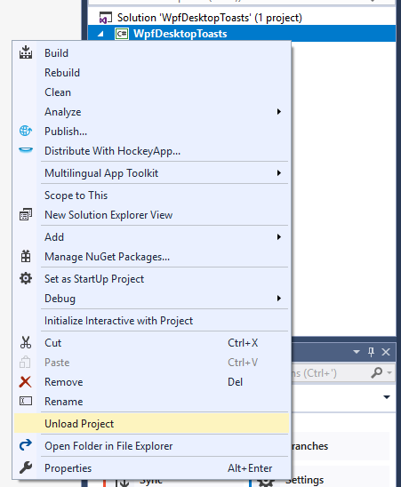
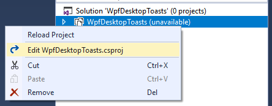
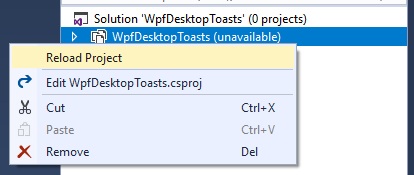
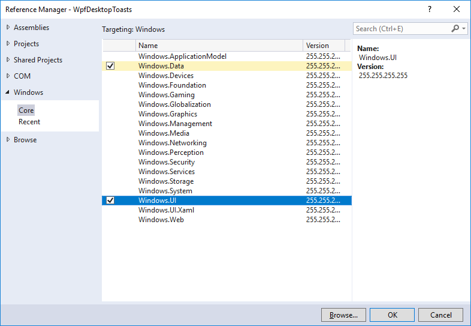

# Send a local toast notification from desktop C# apps

Desktop apps (both Desktop Bridge and classic Win32) can send interactive toast notifications just like Universal Windows Platform (UWP) apps. However, there are a few special steps for desktop apps due to the different activation schemes and the potential lack of package identity if you're not using the Desktop Bridge.

> [!IMPORTANT]
> If you're writing a UWP app, please see the [UWP documentation](send-local-toast.md). For other desktop languages, please see [Desktop C++ WRL](send-local-toast-desktop-cpp-wrl.md).


## Step 1: Enable the Windows 10 SDK

If you haven't enabled the Windows 10 SDK for your Win32 app, you must do that first.

Right click your project and select **Unload Project**.



Then right click your project again, and select **Edit [projectname].csproj**



Below the existing `<TargetFrameworkVersion>` node, add a new `<TargetPlatformVersion>` node specifying your min version of Windows 10 supported. The actual SDK used will be the latest SDK that you have installed on your dev machine. This simply specifies your min allowed version (and allows you to reference the Windows SDK).

```xml
...
<TargetFrameworkVersion>...</TargetFrameworkVersion>
<TargetPlatformVersion>10.0.10240.0</TargetPlatformVersion>
...
```

Save your changes and then reload your project.




## Step 2: Reference the APIs

Open the Reference Manager (right click project, select **Add -> Reference**), and select **Windows -> Core** and include the following references:

* Windows.Data
* Windows.UI




## Step 3: Copy compat library code

Copy the [DesktopNotificationManagerCompat.cs file from GitHub](https://raw.githubusercontent.com/WindowsNotifications/desktop-toasts/master/CS/DesktopToastsApp/DesktopNotificationManagerCompat.cs) into your project. The compat library abstracts much of the complexity of desktop notifications. The following instructions require the compat library.


## Step 4: Implement the activator

You must implement a handler for toast activation, so that when the user clicks on your toast, your app can do something. This is required for your toast to persist in Action Center (since the toast could be clicked days later when your app is closed). This class can be placed anywhere in your project.

Extend the **NotificationActivator** class and then add the three attributes listed below, and create a unique GUID CLSID for your app using one of the many online GUID generators. This CLSID (class identifier) is how Action Center knows what class to COM activate.

```csharp
// The GUID CLSID must be unique to your app. Create a new GUID if copying this code.
[ClassInterface(ClassInterfaceType.None)]
[ComSourceInterfaces(typeof(INotificationActivationCallback))]
[Guid("replaced-with-your-guid-C173E6ADF0C3"), ComVisible(true)]
public class MyNotificationActivator : NotificationActivator
{
    public override void OnActivated(string invokedArgs, NotificationUserInput userInput, string appUserModelId)
    {
        // TODO: Handle activation
    }
}
```


## Step 5: Register with notification platform

Then, you must register with the notification platform. There are different steps depending on whether you are using the Desktop Bridge or classic Win32. If you support both, you must do both steps (however, no need to fork your code, our library handles that for you!).


### Desktop Bridge

If you're using Desktop Bridge (or if you support both), in your **Package.appxmanifest**, add:

1. Declaration for **xmlns:com**
2. Declaration for **xmlns:desktop**
3. In the **IgnorableNamespaces** attribute, **com** and **desktop**
4. **com:Extension** for the COM activator using the GUID from step #4. Be sure to include the `Arguments="-ToastActivated"` so that you know your launch was from a toast
5. **desktop:Extension** for **windows.toastNotificationActivation** to declare your toast activator CLSID (the GUID from step #4).

**Package.appxmanifest**

```xml
<Package
  ...
  xmlns:com="http://schemas.microsoft.com/appx/manifest/com/windows10"
  xmlns:desktop="http://schemas.microsoft.com/appx/manifest/desktop/windows10"
  IgnorableNamespaces="... com desktop">
  ...
  <Applications>
    <Application>
      ...
      <Extensions>

        <!--Register COM CLSID LocalServer32 registry key-->
        <com:Extension Category="windows.comServer">
          <com:ComServer>
            <com:ExeServer Executable="YourProject\YourProject.exe" Arguments="-ToastActivated" DisplayName="Toast activator">
              <com:Class Id="replaced-with-your-guid-C173E6ADF0C3" DisplayName="Toast activator"/>
            </com:ExeServer>
          </com:ComServer>
        </com:Extension>

        <!--Specify which CLSID to activate when toast clicked-->
        <desktop:Extension Category="windows.toastNotificationActivation">
          <desktop:ToastNotificationActivation ToastActivatorCLSID="replaced-with-your-guid-C173E6ADF0C3" /> 
        </desktop:Extension>

      </Extensions>
    </Application>
  </Applications>
 </Package>
```


### Classic Win32

If you're using classic Win32 (or if you support both), you have to declare your Application User Model ID (AUMID) and toast activator CLSID (the GUID from step #4) on your app's shortcut in Start.

Pick a unique AUMID that will identify your Win32 app. This is typically in the form of [CompanyName].[AppName], but you want to ensure this is unique across all apps (feel free to add some digits at the end).

#### Step 5.1: WiX Installer

If you're using WiX for your installer, edit the **Product.wxs** file to add the two shortcut properties to your Start menu shortcut as seen below. Be sure that your GUID from step #4 is enclosed in `{}` as seen below.

**Product.wxs**

```xml
<Shortcut Id="ApplicationStartMenuShortcut" Name="Wix Sample" Description="Wix Sample" Target="[INSTALLFOLDER]WixSample.exe" WorkingDirectory="INSTALLFOLDER">
                    
    <!--AUMID-->
    <ShortcutProperty Key="System.AppUserModel.ID" Value="YourCompany.YourApp"/>
    
    <!--COM CLSID-->
    <ShortcutProperty Key="System.AppUserModel.ToastActivatorCLSID" Value="{replaced-with-your-guid-C173E6ADF0C3}"/>
    
</Shortcut>
```

> [!IMPORTANT]
> In order to actually use notifications, you must install your app through the installer once before debugging normally, so that the Start shortcut with your AUMID and CLSID is present. After the Start shortcut is present, you can debug using F5 from Visual Studio.


#### Step 5.2: Register AUMID and COM server

Then, regardless of your installer, in your app's startup code (before calling any notification APIs), call the **RegisterAumidAndComServer** method, specifying your notification activator class from step #4 and your AUMID used above.

```csharp
// Register AUMID and COM server (for Desktop Bridge apps, this no-ops)
DesktopNotificationManagerCompat.RegisterAumidAndComServer<MyNotificationActivator>("YourCompany.YourApp");
```

If you support both Desktop Bridge and classic Win32, feel free to call this method regardless. If you're running under Desktop Bridge, this method will simply return immediately. There's no need to fork your code.

This method allows you to call the compat APIs to send and manage notifications without having to constantly provide your AUMID. And it inserts the LocalServer32 registry key for the COM server.


## Step 6: Register COM activator

For both Desktop Bridge and classic Win32 apps, you must register your notification activator type, so that you can handle toast activations.

In your app's startup code, call the following **RegisterActivator** method, passing in your implementation of the **NotificationActivator** class you created in step #4. This must be called in order for you to receive any toast activations.

```csharp
// Register COM server and activator type
DesktopNotificationManagerCompat.RegisterActivator<MyNotificationActivator>();
```


## Step 7: Send a notification

Sending a notification is identical to UWP apps, except that you will use the **DesktopNotificationManagerCompat** class to create a **ToastNotifier**. The compat library automatically handles the difference between Desktop Bridge and classic Win32 so you do not have to fork your code. For classic Win32, the compat library caches your AUMID you provided when calling **RegisterAumidAndComServer** so that you don't need to worry about when to provide or not provide the AUMID.

> [!NOTE]
> Install the [Notifications library](https://www.nuget.org/packages/Microsoft.Toolkit.Uwp.Notifications/) so that you can construct notifications using C# as seen below, instead of using raw XML.

Make sure you use the **ToastContent** seen below (or the ToastGeneric template if you're hand-crafting XML) since the legacy Windows 8.1 toast notification templates will not activate your COM notification activator you created in step #4.

> [!IMPORTANT]
> Http images are only supported in Desktop Bridge apps that have the internet capability in their manifest. Classic Win32 apps do not support http images; you must download the image to your local app data and reference it locally.

```csharp
// Construct the visuals of the toast (using Notifications library)
ToastContent toastContent = new ToastContent()
{
    // Arguments when the user taps body of toast
    Launch = "action=viewConversation&conversationId=5",

    Visual = new ToastVisual()
    {
        BindingGeneric = new ToastBindingGeneric()
        {
            Children =
            {
                new AdaptiveText()
                {
                    Text = "Hello world!"
                }
            }
        }
    }
};

// Create the XML document (BE SURE TO REFERENCE WINDOWS.DATA.XML.DOM)
var doc = new XmlDocument();
doc.LoadXml(toastContent.GetContent());

// And create the toast notification
var toast = new ToastNotification(doc);

// And then show it
DesktopNotificationManagerCompat.CreateToastNotifier().Show(toast);
```

> [!IMPORTANT]
> Classic Win32 apps cannot use legacy toast templates (like ToastText02). Activation of the legacy templates will fail when the COM CLSID is specified. You must use the Windows 10 ToastGeneric templates as seen above.


## Step 8: Handling activation

When the user clicks on your toast, the **OnActivated** method of your **NotificationActivator** class is invoked.

Inside the OnActivated method, you can parse the args that you specified in the toast and obtain the user input that the user typed or selected, and then activate your app accordingly.

> [!NOTE]
> The **OnActivated** method is not called on the UI thread. If you'd like to perform UI thread operations, you must call `Application.Current.Dispatcher.Invoke(callback)`.

```csharp
// The GUID must be unique to your app. Create a new GUID if copying this code.
[ClassInterface(ClassInterfaceType.None)]
[ComSourceInterfaces(typeof(INotificationActivationCallback))]
[Guid("replaced-with-your-guid-C173E6ADF0C3"), ComVisible(true)]
public class MyNotificationActivator : NotificationActivator
{
    public override void OnActivated(string invokedArgs, NotificationUserInput userInput, string appUserModelId)
    {
        Application.Current.Dispatcher.Invoke(delegate
        {
            // Tapping on the top-level header launches with empty args
            if (arguments.Length == 0)
            {
                // Perform a normal launch
                OpenWindowIfNeeded();
                return;
            }

            // Parse the query string (using NuGet package QueryString.NET)
            QueryString args = QueryString.Parse(invokedArgs);

            // See what action is being requested 
            switch (args["action"])
            {
                // Open the image
                case "viewImage":

                    // The URL retrieved from the toast args
                    string imageUrl = args["imageUrl"];

                    // Make sure we have a window open and in foreground
                    OpenWindowIfNeeded();

                    // And then show the image
                    (App.Current.Windows[0] as MainWindow).ShowImage(imageUrl);

                    break;

                // Background: Quick reply to the conversation
                case "reply":

                    // Get the response the user typed
                    string msg = userInput["tbReply"];

                    // And send this message
                    SendMessage(msg);

                    // If there's no windows open, exit the app
                    if (App.Current.Windows.Count == 0)
                    {
                        Application.Current.Shutdown();
                    }

                    break;
            }
        });
    }

    private void OpenWindowIfNeeded()
    {
        // Make sure we have a window open (in case user clicked toast while app closed)
        if (App.Current.Windows.Count == 0)
        {
            new MainWindow().Show();
        }

        // Activate the window, bringing it to focus
        App.Current.Windows[0].Activate();

        // And make sure to maximize the window too, in case it was currently minimized
        App.Current.Windows[0].WindowState = WindowState.Normal;
    }
}
```

To properly support being launched while your app is closed, in your `App.xaml.cs` file, you'll want to override **OnStartup** method (for WPF apps) to determine whether you're being launched from a toast or not. If launched from a toast, there will be a launch arg of "-ToastActivated". When you see this, you should stop performing any normal launch activation code, and allow your **OnActivated** code handle launching.

```csharp
protected override async void OnStartup(StartupEventArgs e)
{
    // Register AUMID, COM server, and activator
    DesktopNotificationManagerCompat.RegisterAumidAndComServer<MyNotificationActivator>("YourCompany.YourApp");
    DesktopNotificationManagerCompat.RegisterActivator<MyNotificationActivator>();

    // If launched from a toast
    if (e.Args.Contains("-ToastActivated"))
    {
        // Our NotificationActivator code will run after this completes,
        // and will show a window if necessary.
    }

    else
    {
        // Show the window
        // In App.xaml, be sure to remove the StartupUri so that a window doesn't
        // get created by default, since we're creating windows ourselves (and sometimes we
        // don't want to create a window if handling a background activation).
        new MainWindow().Show();
    }

    base.OnStartup(e);
}
```


### Activation sequence of events

For WPF, the activation sequence is the following...

If your app is already running:

1. **OnActivated** in your **NotificationActivator** is called

If your app is not running:

1. **OnStartup** in `App.xaml.cs` is called with **Args** of "-ToastActivated"
2. **OnActivated** in your **NotificationActivator** is called


### Foreground vs background activation
For desktop apps, foreground and background activation is handled identically - your COM activator is called. It's up to your app's code to decide whether to show a window or to simply perform some work and then exit. Therefore, specifying an **ActivationType** of **Background** in your toast content doesn't change the behavior.


## Step 9: Remove and manage notifications

Removing and managing notifications is identical to UWP apps. However, we recommend you use our compat library to obtain a **DesktopNotificationHistoryCompat** so you don't have to worry about providing the AUMID if you're using classic Win32.

```csharp
// Remove the toast with tag "Message2"
DesktopNotificationManagerCompat.History.Remove("Message2");

// Clear all toasts
DesktopNotificationManagerCompat.History.Clear();
```


## Step 10: Deploying and debugging

To deploy and debug your Desktop Bridge app, see [Run, debug, and test a packaged desktop app](/windows/uwp/porting/desktop-to-uwp-debug).

To deploy and debug your classic Win32 app, you must install your app through the installer once before debugging normally, so that the Start shortcut with your AUMID and CLSID is present. After the Start shortcut is present, you can debug using F5 from Visual Studio.

If your notifications simply fail to appear in your classic Win32 app (and no exceptions are thrown), that likely means the Start shortcut isn't present (install your app via the installer), or the AUMID you used in code doesn't match the AUMID in your Start shortcut.

If your notifications appear but aren't persisted in Action Center (disappearing after the popup is dismissed), that means you haven't implemented the COM activator correctly.

If you've installed both your Desktop Bridge and classic Win32 app, note that the Desktop Bridge app will supersede the classic Win32 app when handling toast activations. That means that toasts from the classic Win32 app will still launch the Desktop Bridge app when clicked. Uninstalling the Desktop Bridge app will revert activations back to the classic Win32 app.


## Known issues

**FIXED: App doesn't become focused after clicking toast**: In builds 15063 and earlier, foreground rights weren't being transferred to your application when we activated the COM server. Therefore, your app would simply flash when you tried to move it to the foreground. There was no workaround for this issue. We fixed this in builds 16299 and higher.


## Resources

* [Full code sample on GitHub](https://github.com/WindowsNotifications/desktop-toasts)
* [Toast notifications from desktop apps](toast-desktop-apps.md)
* [Toast content documentation](adaptive-interactive-toasts.md)

