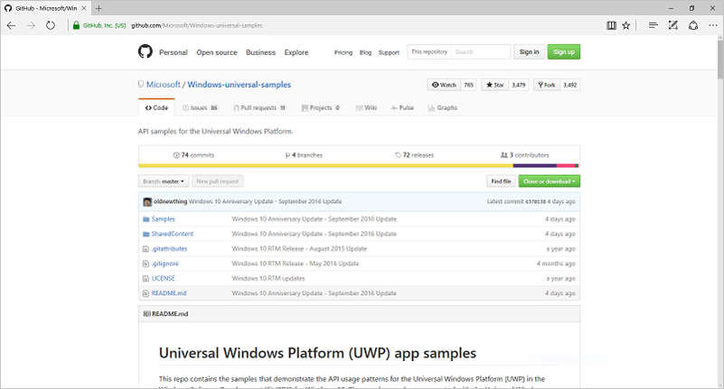
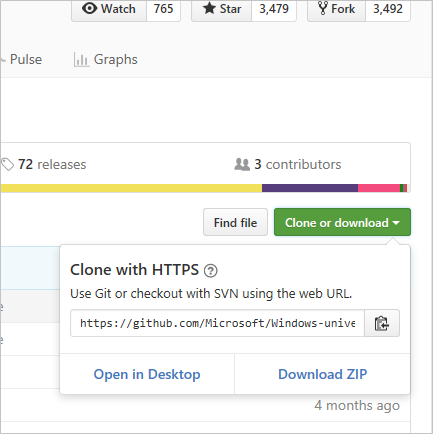

# Get UWP app samples

The Universal Windows Platform (UWP) app samples are available in repositories on GitHub. See [Samples](https://developer.microsoft.com/windows/samples) for a searchable, categorized list, or you can browse the [Microsoft/Windows-universal-samples](https://github.com/Microsoft/Windows-universal-samples "Universal Windows Platform app samples GitHub repository") repository. The Windows-universal-samples repository contains samples that demonstrate all of the UWP features and their API use patterns.

## Download the code

To download the samples, go to the
[repository](https://github.com/Microsoft/Windows-universal-samples "Universal Windows Platform app samples GitHub repository"). Select **Clone or download**, and then select **Download ZIP**. 

You can also [download the samples](https://github.com/Microsoft/Windows-universal-samples/archive/master.zip "Universal Windows Platform app samples zip file download") from this article.

The samples download .zip file always has the latest samples. You don’t need
a GitHub account to download the file. When an SDK update is released or if
you want to pick up any recent changes and additions, just download the latest zip file.

> [!NOTE]
> To open, build, and run UWP samples, you must have Visual Studio 2015 or later and the Windows SDK. You can get a  [free copy of Visual Studio Community](https://www.microsoft.com/?ref=go). Visual Studio Community has support for building UWP apps.  
>
> For the samples to work correctly, be sure to unzip the entire archive and not individual samples. The samples all depend on the SharedContent folder in the archive. The UWP feature samples use Linked files in Visual Studio to reduce duplication of common files, including sample template files and image assets. Common files are stored in the SharedContent folder at the root of the repository. Links are used in the project files to refer to common files.
> 

## Open the samples

After you download the .zip file, open the samples in Visual Studio.

1.  Before you unzip the archive, right-click the file, and then select **Properties** > **Unblock** > **Apply**. Then, unzip the archive in a local folder on your computer.

    
2.  Each folder in the Samples folder contains a UWP feature sample.

    
3.  Select a sample, such as Altimeter. Subfolders indicate the supported languages.

    
4.  Select the folder for the language you want to use. In the folder contents, you’ll see a Visual Studio solution (.sln) file that you can open in Visual Studio. For example, *Altimeter.sln*.

    

## Give feedback, ask questions, and report issues

If you have problems or questions, use the **Issues** tab in the repository to create a new issue. We’ll do what we can to help.

