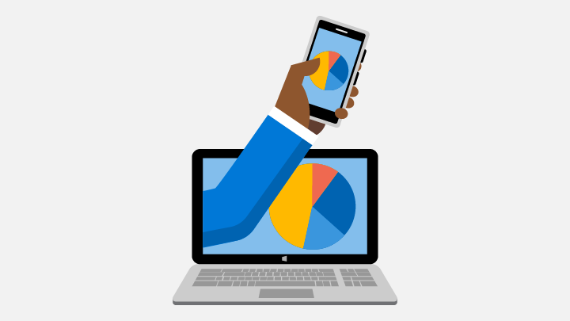
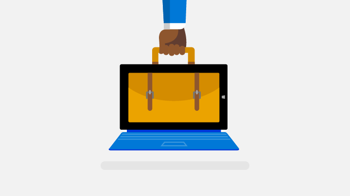
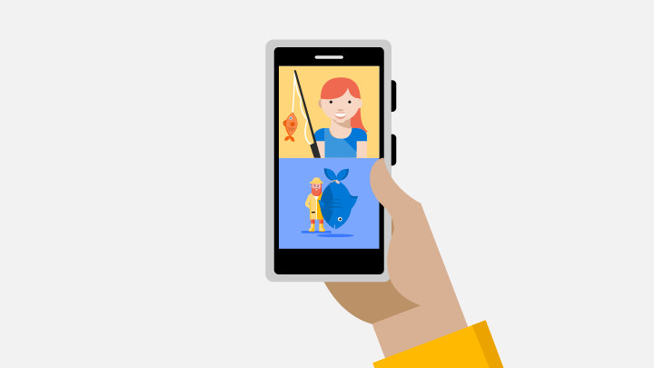
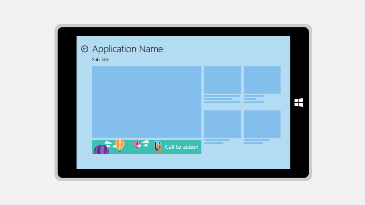
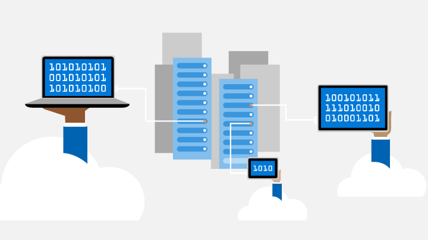
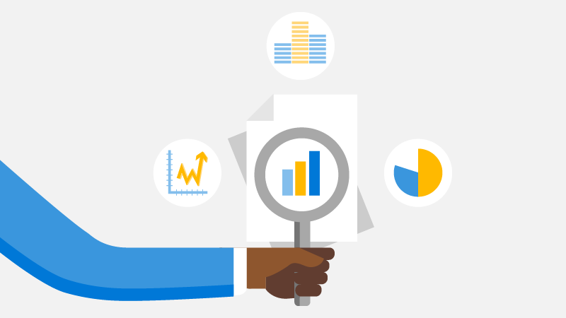

# Monetization, engagement, and Store services

The Windows SDK, Microsoft Advertising SDK, Microsoft Store Services SDK, and the Microsoft Store provide features that enable you to make more money from your apps and gain customers by engaging with your users. The topics in this section show you how to build these features into your app.

For details about the fees charged by the Microsoft Store and how you get paid for the money your app makes, see [Getting paid](../publish/getting-paid-apps.md).

## Choose a pricing model

:::row:::
    :::column:::
        
    :::column-end:::
    :::column span="2":::
**Charge a price for your app**

You can charge a price for your app up front. We support a comprehensive range of price tiers, including the option to set per-market prices. You can even schedule a sale to reduce the price of your app for a limited period of time.

[Set app pricing](../publish/set-app-pricing-and-availability.md)
    :::column-end:::
:::row-end:::

:::row:::
    :::column:::
        
    :::column-end:::
    :::column span="2":::
**Free trials**

You can offer a free trial version of your app to get more customers to try it. To entice customers to buy the full version, you can limit the features in the trial version (for example, only including the first level of a game), show ads, or specify a time-limited trial.

[Offer a trial](in-app-purchases-and-trials.md)
    :::column-end:::
:::row-end:::

:::row:::
    :::column:::
        
    :::column-end:::
    :::column span="2":::
**In-app purchases**

Whether you charge a price for your app or offer it for free, you can use in-app purchases in your app to provide an ongoing revenue stream. Use in-app purchases to let customers upgrade from a free to a paid version of your app, or offer durable or consumable add-ons for sale within your app.

[Use in-app purchases](in-app-purchases-and-trials.md)
    :::column-end:::
:::row-end:::

## Monetize your app with ads

:::row:::
    :::column:::
        
    :::column-end:::
    :::column span="2":::
**Ads for every context**

We support a wide variety of ad experiences to suit most needs, including banner ads, interstitial ads (banner and video), linear video ads, playable ads, and native ads. Our platform is compliant with the OpenRTB, VAST 2.x, MRAID 2, and VPAID 3 standards and is compatible with MOAT and IAS.

[Explore ad options](../publish/create-an-ad-campaign-for-your-app.md)
[Install ad SDK](https://marketplace.visualstudio.com/items?itemName=AdMediator.MicrosoftAdvertisingSDK)
    :::column-end:::
:::row-end:::

:::row:::
    :::column:::
        
    :::column-end:::
    :::column span="2":::
**Ad mediation service**

Maximize ad revenue in your apps by using the microsoft ad mediation service to serve ads from multiple popular ad networks. You can configure your mediation settings in Partner Center without touching a line of code. If you let us configure mediation for you, our machine learning algorithms will help you maximize ad revenue across the markets your app supports.

[Use ad service](https://blogs.windows.com/windowsdeveloper/2017/05/08/announcing-microsofts-ad-mediation-service/)
    :::column-end:::
:::row-end:::

:::row:::
    :::column:::
        
    :::column-end:::
    :::column span="2":::
**Analytics**

Detailed analytics reports let you see how your ads in apps are performing, giving you the information you need to maximize your ad revenue. We also provide a RESTful API you can you use to get this data programmatically.

[Review performance](../publish/advertising-performance-report.md)
    :::column-end:::
:::row-end:::

## Other monetization opportunities

Looking for other ways to increase your monetization? Consider these options.

 Topic                | Description                 |
|--------------------|-----------------------------|
| [Microsoft Affiliate Program](https://www.microsoftaffiliates.com/) | Earn commissions by linking to Microsoft products from your app, blog, web page or other communications. You can link to apps, games, music, movies, hardware, accessories, and other goods sold in the Microsoft Store.
| [A/B experimentation](https://docs.microsoft.com/windows/uwp/monetize/run-app-experiments-with-a-b-testing) | Run A/B tests in your apps to measure the effectiveness of feature changes on some customers before you enable the changes for everyone.
| [Engage customers with the Microsoft Store Services SDK](microsoft-store-services-sdk.md) | The Microsoft Store Services SDK provides libraries and tools that you can use to add features to your apps that help you engage with your customers. These features include targeted notifications, A/B tests, and launching Feedback Hub from your app.
| [Launch Feedback Hub from your app](launch-feedback-hub-from-your-app.md) | Add code to your UWP apps to direct your Windows 10 customers to Feedback Hub, where they can submit problems, suggestions, and upvotes. Then, manage this feedback in the [Feedback report](../publish/feedback-report.md) in Partner Center. This feature requires the Microsoft Store Services SDK. 
| [Configure your app to receive Partner Center push notifications](configure-your-app-to-receive-dev-center-notifications.md) | Register a notification channel for your UWP app so it can receive [Partner Center push notifications](../publish/send-push-notifications-to-your-apps-customers.md), and track the rate of app launches that resulted from the push notifications. This feature requires the Microsoft Store Services SDK.
| [Log custom events for Partner Center](log-custom-events-for-dev-center.md) | Log custom events from your UWP app and review the events in the [Usage report](../publish/usage-report.md) in Partner Center. This feature requires the Microsoft Store Services SDK.
| [Request ratings and reviews](request-ratings-and-reviews.md) | Encourage your customers to rate or review your app by programmatically showing a rating and review UI.
| [Microsoft Store services](using-windows-store-services.md) | Learn how to use RESTful APIs to automate submissions to the Store, access analytics data for your apps, and automate other tasks related to the Store.
| [Add retail demo (RDX) features to your app](retail-demo-experience.md) | Include a retail demo mode in your Windows app so customers who try out PCs and devices on the sales floor can jump right in.

## Monetization analytics

Keep tabs on how your app is performing in the Store by using these reports.

- [Payout summary](../publish/payout-summary.md)
- [Acquisitions report](../publish/acquisitions-report.md)
- [Add-on acquisitions report](../publish/add-on-acquisitions-report.md)
- [Advertising performance report](../publish/advertising-performance-report.md)
- [Get analytics data using our REST API](access-analytics-data-using-windows-store-services.md)
- [Create customer segments](../publish/create-customer-segments.md)
- [Feedback report](../publish/feedback-report.md)
- [Usage report](../publish/usage-report.md)